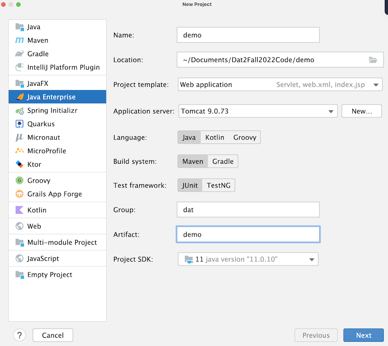

# Dokumentation
dette er min egen dokumentation af java webstak. vi skal lave et intranet
og vil bruge denne dokumentation til bedre at kunne huske hvad vi laver


## Start af webprojekt

1. Opret nyt projekt i intellij
2. Vælg javeEE projektskabelon
3. Java + Maven
4. Servlet dependencies



## Arkitektur

vi anvender en slags MVC-pattern.


- M(odel) - Entiteter og hjælpe - metoder og klasser. Business-logic
- V(iew) - JSP og frontend (css, bootstrap mm)
- C(ontrol) - Servlets

Husk! Ingen kommunikation mellem Model og View. gå altid igennem ontrolleren.


## opret git repo
```shell
git init
git add . 
git commit -m "first commit"
git remote add origin https://github.com/bakkary/Intranet.git
git push -u origin main
``` 